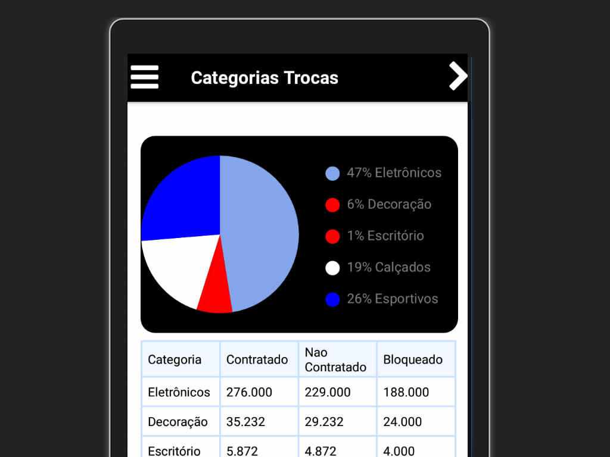

# Gráficos -  React Native

Este é um dashboard composto por gráficos. Cada tela tem um gráfico e uma tabela de resumo.

Recursos que foram utilizados:

* Reactotron
* React Native Chart Kit
* React Navigation
* React Native Table Component

## Instalação

- git clone https://github.com/dbins/graficos
- npm install
- Edite o arquivo /src/config/ReactotronConfig.js e informe o seu IP local. Essa etapa é opcional, é apenas para quem for testar a aplicação usando o Reactotron.
- Abra o emulador. Os testes foram feitos no Windows 10 utilizando o emulador Genymotion (Android)
- react-native run-android
